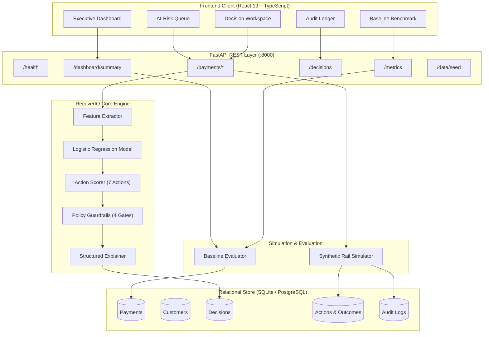

# RecoverIQ

**AI-powered revenue recovery decision engine for failed payments.**

RecoverIQ helps a merchant (demonstrated via **Acme Commerce**) turn failed recurring and checkout payments into intelligent, policy-governed recovery decisions by combining machine-learning recovery prediction, expected-value action scoring, deterministic policy guardrails, synthetic execution, and auditability.

---

## 1. Problem

Traditional failed-payment recovery in recurring billing and digital commerce relies on naive, static retry loops (e.g., retrying an invoice blindly once every 24 hours). 

The same recovery action is not appropriate for every failed transaction. Blind retries introduce severe inefficiencies:
- **Wasted Authorization Quotas**: Payment aggregators and card networks penalize repeated representations of dead instruments.
- **Ignoring Payment-Method Problems**: An expired card or revoked e-mandate cannot succeed via automated retry; it structurally requires customer instrument replacement.
- **Ignoring Customer Context**: Aggressive representations on liquidity-constrained customers trigger overdrafts, chargebacks, and brand churn.
- **Violating Policy Rules**: Static loops ignore billing cycle limits, contact cooldowns, and temporal recovery windows.
- **Suboptimal Recovery Value**: Naive systems fail to optimize for expected recovered revenue across alternative interventions.

RecoverIQ treats post-decline payment recovery as a **constrained decision optimization problem**, answering the central question:

> **"For this failed payment, what is the safest, highest-value recovery action?"**

---

## 2. Solution

RecoverIQ replaces blind retries with an intelligent, four-stage decision pipeline that evaluates context, predicts likelihood, enforces policy, and selects the optimal recovery intervention.

```
Failed / At-Risk Payment
          ↓
  Feature Extraction
          ↓
 ML Recovery Prediction
          ↓
Candidate Action Scoring (7 Actions)
          ↓
 Expected Recovery Value (EV)
          ↓
Deterministic Policy Guardrails (4 Gates)
          ↓
   Best Eligible Action
          ↓
 Synthetic Test Execution
          ↓
     Outcome + Audit
          ↓
   Baseline Comparison
```

### Pipeline Overview
1. **Failed / At-Risk Payment**: Ingests failed transaction events with invoice amounts, customer behavioral context, and acquirer decline codes.
2. **Feature Extraction**: Assembles a multi-dimensional feature vector spanning payment telemetry, customer lifetime value, historical recovery rate, and contact fatigue.
3. **ML Recovery Prediction**: A calibrated Logistic Regression model estimates the baseline recovery probability $P_{\text{base}}$.
4. **Candidate Action Scoring**: Evaluates all 7 canonical recovery actions, deriving action-specific success estimates based on failure reason and payment rail compatibility.
5. **Expected Recovery Value (EV)**: Calculates expected recovered revenue ($\text{EV} = \text{Amount} \times P_{\text{derived}}$) across all candidate strategies.
6. **Deterministic Policy Guardrails**: Enforces non-negotiable business rules across 4 deterministic gates. Unsafe or quota-exhausted actions are flagged as `RESTRICTED` or `BLOCKED`.
7. **Best Eligible Action**: Selects the eligible (non-blocked) strategy with the highest Expected Recovery Value.
8. **Synthetic Test Execution**: Executes the chosen action against a simulated payment rail with synthetic gateway response codes.
9. **Outcome + Audit**: Persists the decision, policy evaluation checklist, execution outcome, and transaction reference to an immutable audit ledger.
10. **Baseline Comparison**: Continuously benchmarks RecoverIQ's cumulative recovery rate and recovered revenue against a fixed naive retry baseline.

---

## 3. What Makes RecoverIQ Different

| Dimension | Legacy Retry Engines | RecoverIQ Decision Engine |
| :--- | :--- | :--- |
| **Recovery Prediction** | None; assumes fixed recovery odds across all transactions. | Machine-learning model estimates transaction-specific base recovery likelihood. |
| **Action Spectrum** | Single action (blind retry loop). | Evaluates **7 canonical recovery actions** tailored to failure taxonomy. |
| **Optimization Target** | Count of retry attempts. | **Expected Recovery Value (EV)**: balances ticket amount against action success odds. |
| **Safety & Governance** | Hardcoded retry timers or unconstrained heuristics. | **Deterministic Policy Guardrails**: strict pre-execution code gates that block unsafe actions. |
| **Explainability** | Black-box gateway error codes. | Evidence-based 3-part structured rationales (Why selected, Telemetry drivers, Tradeoffs). |
| **Execution Safety** | Direct production charges risking quota penalties. | Synthetic test-mode simulation with synthetic acquirer references (`sim_tx_...`). |
| **Auditability** | Ephemeral gateway webhook logs. | Complete relational audit ledger with decision rationale, policy checks, and timestamps. |
| **Empirical Baseline** | Self-reported arbitrary claims. | Transparent side-by-side benchmark against a standard fixed-retry policy. |

> **Important Methodological Note**: Action-specific probabilities in RecoverIQ are derived estimates based on baseline recovery likelihood and failure-mode compatibility adjustments. They are **not** causal treatment effects estimated from randomized controlled trials.

---

## 4. The 7 Canonical Recovery Actions

RecoverIQ considers all seven canonical actions for every transaction:

| Action Identifier | Display Label | Description |
| :--- | :--- | :--- |
| `retry_now` | **Retry Now** | Immediate automated representation to the gateway switch for transient network drops or timeouts. |
| `retry_later` | **Retry Later** | Smart delayed representation scheduled for the customer's next liquidity or bank clearing window. |
| `send_payment_link` | **Send Payment Link** | Dispatches a dynamic multi-rail payment link (UPI, NetBanking, alternate cards) directly to the customer. |
| `send_reminder` | **Send Reminder** | Non-intrusive notification via SMS or Email alerting the customer without initiating a debit attempt. |
| `request_payment_method_update` | **Request Payment Method Update** | Directs customer to update an expired card token or replace an invalid auto-debit mandate. |
| `escalate_to_human` | **Escalate to Human** | Routes high-value or VIP invoices to a dedicated account manager for white-glove outreach. |
| `stop_recovery` | **Stop Recovery** | Safely terminates recovery attempts when retry quotas are exhausted or failure is permanent. |

---

## 5. Deterministic Policy Guardrails

The AI model does **not** have unconstrained authority. Before any action can be recommended or simulated, it must pass through four deterministic code gates. Guardrails evaluate merchant policy, customer fatigue, and rail validity:

```
[Candidate Action with Highest EV]
               │
               ▼
   ┌───────────────────────┐
   │ Gate 1: Retry Limit   │──(Exhausted)──► BLOCKED / RESTRICTED
   └───────────────────────┘
               │ (Pass)
               ▼
   ┌───────────────────────┐
   │ Gate 2: 72h Window    │──(Expired)────► BLOCKED / RESTRICTED
   └───────────────────────┘
               │ (Pass)
               ▼
   ┌───────────────────────┐
   │ Gate 3: Contact Cool  │──(Fatigued)───► BLOCKED / RESTRICTED
   └───────────────────────┘
               │ (Pass)
               ▼
   ┌───────────────────────┐
   │ Gate 4: Method Health │──(Invalid)────► BLOCKED / RESTRICTED
   └───────────────────────┘
               │ (Pass)
               ▼
  [APPROVED FOR SIMULATION]
```

### The 4 Deterministic Gates
1. **Retry Threshold Limit (`g_retry_limit`)**: Enforces maximum allowable automated representations per billing cycle (default: 3 attempts). Prevents card network fines and issuer blocklisting.
2. **72-Hour Active Recovery Window (`g_recovery_window`)**: Establishes temporal policy boundaries. Invoices older than 72 hours are restricted from autonomous retries to prevent stale charges.
3. **Customer Contact Cooldown (`g_contact_cooldown`)**: Throttles customer-facing communications when contact frequency or fatigue score exceeds limits (max 2 outbound touchpoints per 24 hours).
4. **Payment-Method Eligibility & Rail Health (`g_method_eligibility`)**: Validates instrument health. Direct representations on expired cards or invalid/paused mandates are strictly `BLOCKED`.

*Terminology Note*: RecoverIQ uses **deterministic policy guardrails**, not regulatory certifications.

---

## 6. AI / ML Architecture

RecoverIQ uses a supervised machine learning pipeline trained to predict baseline recovery probability from transaction and customer telemetry.

```
Incoming Payment Context
          │
          ▼
┌─────────────────────────────────────────────────────────────┐
│ Feature Vector Preprocessor (StandardScaler + OneHotEncoder)│
│ Numerical: amount, retry_count, customer_ltv, etc.          │
│ Categorical: payment_method, failure_reason                 │
└─────────────────────────────────────────────────────────────┘
          │
          ▼
┌─────────────────────────────────────────────────────────────┐
│ Calibrated Logistic Regression Classifier                   │
│ Output: Base Recovery Probability P(base) ∈ [0.0, 1.0]       │
└─────────────────────────────────────────────────────────────┘
          │
          ▼
┌─────────────────────────────────────────────────────────────┐
│ Action Scoring Engine                                       │
│ Derives P(action) & Expected Recovery Value (EV)            │
└─────────────────────────────────────────────────────────────┘
```

### Feature Engineering
- **Numerical Features (6)**:
  - `amount`: Transaction amount in INR.
  - `retry_count`: Number of prior representation attempts.
  - `customer_ltv`: Cumulative historical spend by customer.
  - `historical_recovery_rate`: Customer's past recovery success ratio.
  - `avg_recovery_latency_hours`: Historical turnaround time for successful resolution.
  - `retry_fatigue_score`: Behavioral index tracking recent contact frequency.
- **Categorical Features (2)**:
  - `payment_method`: Credit Card, Debit Card, UPI, NetBanking, Mandate.
  - `failure_reason`: `insufficient_funds`, `technical_glitch`, `card_expired`, `mandate_invalid`, `limit_exceeded`.

### Model Validation Metrics
The baseline classifier is evaluated on held-out synthetic test records using an 80/20 stratified split:

| Metric | Validation Value | Interpretation |
| :--- | :---: | :--- |
| **Model Type** | `LogisticRegression` | L-BFGS solver with balanced regularization |
| **Model Version** | `RecoverIQ-LogReg-v1.0.0` | Persisted joblib pipeline artifact |
| **Accuracy** | **61.00%** | Overall correct classification on held-out split |
| **Precision** | **61.40%** | Proportion of positive predictions that recovered |
| **Recall** | **67.31%** | Proportion of actual recoveries correctly identified |
| **F1-Score** | **64.22%** | Harmonic mean of precision and recall |
| **ROC-AUC** | **0.7079** | Strong discriminatory ability between outcome classes |
| **Brier Score** | **0.2145** | Well-calibrated probability scoring |

*Clarification*: Model validation metrics evaluate classifier discrimination on synthetic test records. They do not represent business revenue recovery performance.

---

## 7. Action-Scoring Methodology

1. **Base Probability Estimation**: The ML model predicts $P_{\text{base}} = P(\text{recovered} \mid X)$.
2. **Derived Action Probability**: For each candidate action $a \in \mathcal{A}$, the engine calculates:
   $$P(a) = \text{clamp}\left(P_{\text{base}} \times \alpha_{\text{rail}}(a) \times \beta_{\text{reason}}(a),\, 0.02,\, 0.95\right)$$
   where $\alpha_{\text{rail}}$ and $\beta_{\text{reason}}$ are domain compatibility multipliers.
3. **Expected Recovery Value**:
   $$\text{EV}(a) = \text{Amount} \times P(a)$$
4. **Guardrail Filtering**: Each candidate is evaluated against the 4 policy checks (`PASS`, `RESTRICTED`, or `BLOCKED`).
5. **Selection**: The engine selects $\arg\max_{a \in \mathcal{A}_{\text{eligible}}} \text{EV}(a)$. If all active recovery actions are blocked, it defaults safely to `stop_recovery`.

> **Non-Causal Disclaimer**: The system does not claim causal action effects from observational or synthetic data. Action probabilities are derived decision heuristics designed to rank operational alternatives.

---

## 8. Synthetic Dataset

RecoverIQ operates with synthetic records generated specifically for development, demonstration, and benchmark evaluation:
- **Cohort Volume**: 3,000 payment records across 600 unique customers.
- **Deterministic Reproducibility**: Generated using pseudorandom seed `42`.
- **Merchant Identity**: All transactions belong to **Acme Commerce**, representing an internal merchant deployment.
- **Synthesized Fields**:
  - `Payment`: `id`, `amount`, `currency` (INR), `payment_method`, `payment_method_details`, `failure_reason`, `failure_code`, `status`, `priority`, `retry_count`, `max_retries_allowed`, `failed_at`.
  - `Customer`: `id`, `name`, `email`, `segment` (Enterprise, Growth, Startup, Retail), `lifetime_value`, `successful_payments`, `failed_payments`, `historical_recovery_rate`, `avg_recovery_latency_hours`, `retry_fatigue_score`.

---

## 9. Baseline Methodology

To evaluate RecoverIQ objectively, the platform benchmarks performance against a standard industry baseline:
- **Baseline Strategy**: Fixed Naive Retry.
- **Retry Sequence**:
  - Attempt 1: Immediate retry (`retry_now`)
  - Attempt 2: Delayed retry (`retry_later`)
  - Attempt 3: Final delayed retry (`retry_later` with fatigue penalty)
  - Exhaustion: Terminal stop (`stop_recovery`)
- **Key Baseline Dynamics**:
  - Recovers transient technical drops reasonably well on Attempt 1.
  - Has zero recovery on structural failures (`card_expired`, `mandate_invalid`, `limit_exceeded`) because blind retries cannot fix invalid instruments.
  - Incurs progressive fatigue penalties on repeated customer representations.

---

## 10. Synthetic Evaluation Benchmark

> **Cohort Specification**: Evaluated across the exact same **3,000-payment synthetic evaluation cohort** (Seed: `42`).

| Evaluation Metric | Fixed Naive Baseline | RecoverIQ Engine | Absolute Lift | Relative Lift |
| :--- | :---: | :---: | :---: | :---: |
| **Total Cohort Size** | 3,000 payments | 3,000 payments | — | — |
| **Total Volume at Risk** | ₹200,888,283.16 | ₹200,888,283.16 | — | — |
| **Recovered Cases** | 1,676 payments | **2,296 payments** | **+620 payments** | — |
| **Recovery Rate** | **55.87%** | **76.53%** | **+20.67 pp** | **+36.99%** |
| **Recovered Revenue** | ₹112,238,623.68 | **₹153,745,263.14** | **+₹35,960,711.46** | **+36.99%** |
| **Policy Violations** | N/A | **0 (100% compliant)** | — | Zero blocked actions executed |

*Evaluation Statement*: On the 3,000-payment synthetic evaluation cohort, RecoverIQ achieved a **36.99% relative lift** (+20.67 percentage points) over the fixed-retry baseline, recovering **+₹35,960,711.46** in incremental revenue with zero policy violations.

---

## 11. Product & UI Overview

RecoverIQ features an editorial-style interface designed for institutional clarity and operational speed:

```
┌────────────────────────────────────────────────────────────────────────────┐
│ RecoverIQ  [Acme Commerce]  [Single Merchant Scope]  [Synthetic Test Mode]  │
├─────────────┬───────────────────┬──────────────────────┬───────────────────┤
│  Dashboard  │  At-Risk Payments │  Baseline Benchmark  │   Audit History   │
└─────────────┴───────────────────┴──────────────────────┴───────────────────┘
```

### 1. Dashboard (Executive Control Tower)
- **Top Metric Cards**: Revenue At Risk, Estimated Recoverable, Revenue Recovered, Additional Revenue vs Baseline, Recovery Rate.
- **Dual-Scope Indicator**: Explicitly flags Active Unresolved Queue vs. Full Evaluated Benchmark Cohort.
- **4-Stage Pipeline**: Visualizes cases transitioning through *Identified → Scored → Policy-Verified → Recovered*.
- **Canonical Actions Breakdown**: Distribution of recovery recommendations across all 7 actions.
- **Failure Taxonomy & Payment Method Charts**: Breakdown of root causes and rail distributions.
- **Priority Queue**: Highlights high-value, high-likelihood at-risk invoices requiring immediate attention.

### 2. At-Risk Payments & Queue (Operational Worklist)
- **Search & Filters**: Filter by Status, Failure Reason, Payment Rail, or Customer Tier.
- **Metrics at a Glance**: Displays Ticket Amount, Base Likelihood, Expected Recovery Value, and Priority.
- **Action Recommendation**: Displays the winning strategy badge for each invoice.
- **Inspection CTA**: Deep-links directly to the Payment Decision Workspace.

### 3. Payment Recovery Intelligence Workspace (Deep Decision View)
- **Dominant Primary Decision Hero**: Clear visual hierarchy showing *Failed Payment Context* alongside the *Winning Recommendation* and an immediate *"Why this action?"* summary.
- **4-Gate Policy Checklist**: Shows pass/block status for each guardrail with a progressive disclosure toggle for full policy notes.
- **Candidate Strategy Matrix**: Compact table comparing all 7 canonical actions by Probability, Expected Value, and Policy Status.
- **Structured Rationale**: Explains primary selection factors, telemetry drivers, and alternative tradeoffs.
- **Simulation Workbench**: One-click test-mode execution that verifies guardrails before running synthetic rail simulation.
- **Audit Reference Footer**: Displays simulated reference ID, model version, and execution timestamp.

### 4. Baseline Benchmark (Strategy Analytics)
- Side-by-side comparison cards: RecoverIQ Recovery Rate vs. Fixed Retry Baseline.
- Cumulative revenue trajectory chart comparing policy-driven recovery against naive retries.
- Relative conversion lift (+36.99%) and net incremental revenue recovered (+₹3.59 Cr).

### 5. Decision & Policy Audit Ledger (Governance & Compliance)
- Read-only audit log tracking every decision event.
- Columns: Decision ID, Payment ID, Customer Name, Amount, Recommended Action, Expected Value, Guardrail Status, Execution State, Outcome, and Timestamp.
- Inspection Drawer: View complete raw policy checks and simulation logs for any selected audit record.

---

## 12. Project Structure

```
recoveriq/
├── src/                                  # Frontend source (React 19 + TypeScript)
│   ├── App.tsx                           # Routing, tab orchestration & URL syncing
│   ├── main.tsx                          # React DOM entry point
│   ├── index.css                         # Global CSS & Tailwind styling
│   ├── components/
│   │   ├── common/                       # Shared UI badges, cards, and indicators
│   │   │   ├── Badge.tsx                 # Status & priority badges
│   │   │   ├── MetricCard.tsx            # KPI metric card component
│   │   │   └── ProbabilityBadge.tsx      # Recovery likelihood badge
│   │   ├── dashboard/                    # Primary product views
│   │   │   ├── DashboardView.tsx         # Executive Control Tower
│   │   │   ├── PaymentsListView.tsx      # At-Risk Payments Worklist
│   │   │   ├── PaymentDecisionWorkspace.tsx # Deep Payment Decision Workspace
│   │   │   ├── StrategyAnalyticsView.tsx # Baseline Benchmark view
│   │   │   ├── DecisionsAuditView.tsx    # Decision & Audit Ledger
│   │   │   ├── DecisionAuditDrawer.tsx   # Detailed audit inspection drawer
│   │   │   ├── BreakdownCharts.tsx       # Failure & method distribution charts
│   │   │   ├── PriorityQueue.tsx         # Urgent payment queue widget
│   │   │   ├── RecentDecisions.tsx       # Recent activity feed
│   │   │   ├── RevenuePipeline.tsx       # 4-stage funnel visualization
│   │   │   └── RecoveryVsBaselineChart.tsx # Benchmark comparison chart
│   │   └── layout/                       # Structural layout components
│   │       ├── Layout.tsx                # Main container layout
│   │       ├── TopBar.tsx                # Navigation header & tabs
│   │       ├── EditorialHeader.tsx       # Editorial brand header
│   │       └── Sidebar.tsx               # Auxiliary navigation
│   ├── services/
│   │   ├── api.ts                        # Typed Axios/Fetch client for FastAPI
│   │   ├── mockData.ts                   # Fallback mock dataset
│   │   ├── mockDecisions.ts              # Fallback mock decisions
│   │   └── mockService.ts                # Mock service abstraction
│   ├── types/
│   │   └── index.ts                      # Shared TypeScript domain interfaces
│   └── utils/
│       ├── formatters.ts                 # Currency (INR) and date formatters
│       └── recoveryIntelligence.ts       # Frontend decision helpers
│
├── backend/                              # Backend source (Python 3.11 + FastAPI)
│   ├── requirements.txt                  # Python dependencies
│   ├── pytest.ini                        # Pytest configuration
│   ├── recoveriq.db                      # SQLite database file (development)
│   ├── smoke_test.py                     # Rapid sanity test script
│   ├── verify_p0.py                      # Verification script for decision engine
│   ├── app/
│   │   ├── main.py                       # FastAPI application & middleware entry point
│   │   ├── api/
│   │   │   ├── deps.py                   # SQLAlchemy session dependency
│   │   │   └── routes/                   # REST API route handlers
│   │   │       ├── health.py             # GET /health
│   │   │       ├── dashboard.py          # GET /dashboard/summary
│   │   │       ├── payments.py           # GET/POST /payments endpoints
│   │   │       ├── decisions.py          # GET /decisions
│   │   │       ├── metrics.py            # GET /metrics
│   │   │       └── data.py               # POST /data/seed
│   │   ├── baseline/
│   │   │   └── evaluator.py              # Fixed retry simulation & comparative benchmark
│   │   ├── core/
│   │   │   └── config.py                 # Application settings & environment variables
│   │   ├── db/
│   │   │   └── session.py                # Database engine & sessionmaker
│   │   ├── engine/                       # Core Decision Engine
│   │   │   ├── action_scoring.py         # 7-action EV scoring logic
│   │   │   ├── guardrails.py             # 4 deterministic policy gates
│   │   │   ├── explainer.py              # Structured 3-part rationale generator
│   │   │   └── orchestrator.py           # End-to-end decision orchestration
│   │   ├── ml/                           # Machine Learning pipeline
│   │   │   ├── features.py               # Feature extraction & column transformers
│   │   │   ├── predictor.py              # Inference service using trained model
│   │   │   ├── synthetic_generator.py    # 3,000-record synthetic data generator
│   │   │   ├── train.py                  # Model training & metric logging pipeline
│   │   │   └── artifacts/                # Persisted ML model artifacts
│   │   │       ├── logistic_regression_v1.joblib
│   │   │       └── model_metrics.json
│   │   ├── models/                       # SQLAlchemy declarative models
│   │   │   ├── base.py                   # Declarative base class
│   │   │   ├── customer.py               # Customer entity
│   │   │   ├── payment.py                # Payment transaction entity
│   │   │   ├── decision.py               # Recovery decision entity
│   │   │   ├── action.py                 # Recovery action & outcome entities
│   │   │   ├── audit.py                  # Immutable audit log entity
│   │   │   └── prediction.py             # Base ML prediction entity
│   │   ├── schemas/                      # Pydantic validation schemas
│   │   │   ├── common.py                 # Enums (actions, reasons, statuses)
│   │   │   └── payloads.py               # Request and response models
│   │   └── simulation/
│   │       └── simulator.py              # Test-mode synthetic payment rail simulator
│   └── tests/                            # Automated test suite (18 tests)
│       ├── conftest.py                   # Pytest fixtures & in-memory test DB
│       ├── test_api.py                   # REST API endpoint tests
│       ├── test_baseline.py              # Baseline evaluation logic tests
│       ├── test_engine.py                # Guardrail & scoring engine tests
│       ├── test_ml.py                    # Feature extraction & predictor tests
│       └── test_simulation.py            # Simulation & outcome logging tests
│
├── public/                               # Static assets
├── .env.example                          # Frontend environment template
├── package.json                          # Node.js dependencies & scripts
├── tsconfig.json                         # TypeScript compiler configuration
├── vite.config.ts                        # Vite build configuration
└── README.md                             # Project documentation
```

---

## 13. API Documentation

The backend exposes a REST API powered by FastAPI. When running locally, interactive Swagger/OpenAPI documentation is available at:

> **OpenAPI Documentation**: [http://127.0.0.1:8000/docs](http://127.0.0.1:8000/docs)

| Method | Endpoint | Description | Key Inputs | Key Output Fields |
| :--- | :--- | :--- | :--- | :--- |
| `GET` | `/health` | Service liveness & database connectivity check | None | `status`, `version`, `database` |
| `GET` | `/dashboard/summary` | Executive dashboard recovery KPIs & cohort stats | None | `revenueAtRisk`, `predictedRecoverableRevenue`, `recoveredRevenue`, `aiRecoveryRate`, `baselineRecoveryRate`, `breakdowns` |
| `GET` | `/payments` | Paginated list of payments with filtering | `skip`, `limit`, `status`, `priority`, `failure_reason`, `payment_method` | `items[]`, `total` |
| `GET` | `/payments/{id}` | Full payment record with decision & candidate matrix | `payment_id` (path) | Full `PaymentRecord` with candidate actions & guardrail checklist |
| `POST` | `/payments/{id}/score` | Computes base ML recovery probability | `payment_id` (path) | `baseRecoveryProbability`, `modelVersion`, `features` |
| `POST` | `/payments/{id}/decide` | Evaluates all 7 actions, verifies policy, selects winner | `payment_id` (path) | `recommendedAction`, `expectedRecoveryValue`, `policyStatus`, `candidateActions[]`, `guardrails[]`, `structuredExplanation` |
| `POST` | `/payments/{id}/execute` | Simulates execution on synthetic rail | `payment_id` (path), optional `action_type` | `executionStatus`, `simulatedReference`, `recovered`, `recoveredAmount`, `executionLogs` |
| `GET` | `/decisions` | Chronological list of recovery decisions & outcomes | `skip`, `limit` | `items[]` (audited decisions with policy notes) |
| `GET` | `/metrics` | ML validation metrics & empirical baseline comparison | None | `modelVersion`, `mlMetrics`, `recoveryComparison` |
| `POST` | `/data/seed` | Re-seeds database with reproducible synthetic records | `count` (default: 3000), `seed` (default: 42) | `status`, `totalCustomers`, `totalPayments`, `activeAtRisk`, `recoveredCases` |

---

## 14. Tech Stack

### Frontend
- **Framework**: React 19 (`react`, `react-dom`)
- **Language**: TypeScript 5.8
- **Build Tool**: Vite 6
- **Styling**: Tailwind CSS v4
- **Icons**: Lucide React (`lucide-react`)
- **Visualizations**: Recharts (`recharts`)

### Backend
- **Framework**: FastAPI 0.115+
- **ASGI Server**: Uvicorn (`uvicorn`)
- **Language**: Python 3.11+
- **ORM & Database**: SQLAlchemy 2.0 with SQLite (PostgreSQL compatible via `DATABASE_URL`)
- **Validation**: Pydantic v2 & Pydantic Settings
- **Machine Learning**: Scikit-learn (`scikit-learn`), NumPy (`numpy`), Joblib (`joblib`)
- **Testing**: Pytest (`pytest`), Starlette TestClient

---

## 15. System Architecture



---

## 16. End-to-End Decision Flow

For every failed payment event:

```
[1. Payment Failure Event]
         │
         ▼
[2. Context Extraction] ──────► Reads invoice amount, decline code, customer LTV, retry count
         │
         ▼
[3. ML Recovery Model]  ──────► Predicts base recovery probability P(base)
         │
         ▼
[4. Action Scoring]     ──────► Calculates P(action) & Expected Recovery Value for all 7 actions
         │
         ▼
[5. Guardrail Checks]   ──────► Evaluates Retry Limits, 72h Window, Cooldown, and Method Health
         │
         ▼
[6. Optimal Selection]  ──────► Chooses non-blocked action with highest Expected Recovery Value
         │
         ▼
[7. Rationale Synthesis] ─────► Generates structured 3-part rationale (Why, Telemetry, Tradeoffs)
         │
         ▼
[8. Test-Mode Execution] ─────► Simulates acquirer response on synthetic rail (zero real money movement)
         │
         ▼
[9. Audit Persistence]  ──────► Logs immutable audit record with simulation reference ID
```

### Layer Responsibilities
- **Machine Learning Layer**: Predicts recovery likelihood based on empirical patterns.
- **Policy Guardrail Layer**: Decides which interventions are legally, operationally, and contractually permissible.
- **Simulation Layer**: Safely models rail behavior without live payment risks.
- **Audit Layer**: Records complete decision provenance for governance and retrospective analysis.

---

## 17. Local Setup & Quick Start

### Prerequisites
- **Python**: Version 3.11 or higher
- **Node.js**: Version 18 or higher (Node 20 / 22 recommended)
- **npm**: Version 9 or higher
- **Git**

---

### Step 1: Clone Repository
```bash
git clone https://github.com/ayush2005k/RecoverIQ.git
cd RecoverIQ
```

---

### Step 2: Start the Backend (FastAPI)

Open a terminal window:

```powershell
# Navigate to backend directory
cd backend

# Create virtual environment
python -m venv .venv

# Activate virtual environment (Windows PowerShell)
.\.venv\Scripts\Activate.ps1
# Or on Windows Command Prompt:
# .\.venv\Scripts\activate.bat

# Install dependencies
pip install -r requirements.txt

# Start FastAPI server on port 8000
uvicorn app.main:app --host 127.0.0.1 --port 8000 --reload
```

The backend server is live at:
- API Base: `http://127.0.0.1:8000`
- Interactive Docs: `http://127.0.0.1:8000/docs`
- Health Check: `http://127.0.0.1:8000/health`

---

### Step 3: Start the Frontend (Vite + React)

Open a second terminal window in the project root:

```bash
# Install frontend dependencies
npm install

# Start Vite development server on port 3000
npm run dev
```

Open your browser at:
> **Web Interface**: [http://localhost:3000](http://localhost:3000)

---

### Step 4: Seed Synthetic Data (Automated / Manual)

The database automatically initializes and seeds on first launch. If you wish to re-seed the benchmark cohort with reproducible data:

```bash
# Using PowerShell / curl
curl -X POST "http://127.0.0.1:8000/data/seed?count=3000&seed=42"
```

---

## 18. Environment Variables

### Frontend Configuration (`.env`)
Create a `.env` file in the project root (see `.env.example`):

| Variable | Default Value | Required | Description |
| :--- | :--- | :---: | :--- |
| `VITE_API_BASE_URL` | `http://127.0.0.1:8000` | No | Base URL of the FastAPI backend service |
| `VITE_USE_MOCK` | `false` | No | Set to `true` to use client-side mock data if backend is offline |

### Backend Configuration (`backend/.env`)
Create a `backend/.env` file (see `backend/.env.example`):

| Variable | Default Value | Required | Description |
| :--- | :--- | :---: | :--- |
| `PROJECT_NAME` | `RecoverIQ Decision Engine` | No | Display name of the backend service |
| `ENVIRONMENT` | `development` | No | Runtime environment (`development`, `production`) |
| `DATABASE_URL` | `sqlite:///./recoveriq.db` | No | SQLAlchemy connection string (SQLite or PostgreSQL) |
| `RECOVERIQ_SEED` | `42` | No | Random seed for reproducible synthetic data |
| `RECOVERIQ_SYNTHETIC_SIZE` | `3000` | No | Number of synthetic payment records to generate |

---

## 19. Testing & Quality Assurance

### 1. Backend Automated Tests (Pytest)
The backend test suite covers API routes, the baseline evaluator, the decision engine, ML pipelines, and test-mode simulation.

```bash
cd backend
.\.venv\Scripts\pytest -v
```

**Results (18 passed in 2.65s)**:
- `tests/test_api.py`: Health, seed, payments list/detail, score, decide, execute, metrics (`8 tests PASSED`)
- `tests/test_baseline.py`: Baseline vs. RecoverIQ comparative evaluation (`1 test PASSED`)
- `tests/test_engine.py`: 7-action scoring, guardrail blocking for expired cards and exhausted retries, orchestrator (`4 tests PASSED`)
- `tests/test_ml.py`: Feature extraction, training pipeline, predictor calibration (`3 tests PASSED`)
- `tests/test_simulation.py`: Success flow and guardrail violation prevention in simulation (`2 tests PASSED`)

### 2. Frontend Linting & Production Build
```bash
# TypeScript typechecking
npm run lint

# Production bundle build
npm run build
```

---

## 20. 5-Minute Demo Walkthrough

Judges and evaluators can follow this step-by-step walkthrough to experience RecoverIQ:

1. **Dashboard Overview (`/`)**:
   - Observe the headline KPIs: **Revenue At Risk** (active queue) alongside **Estimated Recoverable Revenue**.
   - Review the dual-scope indicator strip explaining the difference between the active queue and the 3,000-payment benchmark cohort.
2. **At-Risk Queue (`/payments`)**:
   - Inspect the operational table. Use filter presets (e.g. *Enterprise Only*, *Cards Only*, or *High Value*).
   - Observe how each invoice already features a base recovery likelihood and recommended action.
3. **Deep Decision Workspace (`/payments/{id}`)**:
   - Click **"View Decision"** on any at-risk payment.
   - Look at the **Dominant Primary Decision Hero**: the left card displays the failed payment context; the right card displays RecoverIQ's winning action and an immediate *"Why this action?"* summary.
4. **Inspect Policy Guardrails**:
   - Review the **4-Gate Policy Checklist**. Notice that if a payment failed due to an expired card, direct retry is explicitly `BLOCKED`.
5. **Inspect the 7-Action Strategy Matrix**:
   - Review the compact candidate table. Notice how Expected Recovery Value ($\text{EV}$) balances success probability against ticket value.
6. **Simulate Test Recovery**:
   - Click the **"Simulate Test Recovery"** button in the workbench.
   - Observe instant simulated acquirer execution, generating a synthetic reference ID (`sim_tx_...`) and persisting an outcome record.
7. **Verify Audit Ledger (`/decisions`)**:
   - Switch to the **Decision & Audit History** tab.
   - Confirm the transaction appears in the read-only audit log with its recommended action, guardrail verification status, and timestamp.
8. **Inspect Baseline Benchmark (`/analytics`)**:
   - Navigate to **Baseline Benchmark**.
   - Review the empirical lift: **+36.99% relative lift** (+20.67 percentage points) over static retries.

---

## 21. Safety & Limitations

- **Synthetic Mode Only**: All recovery execution occurs in test-mode on simulated payment rails. RecoverIQ does **not** move real money or connect to live production banking switches.
- **Synthetic Data**: Invoices, customer profiles, and decline histories are generated for demonstration and evaluation purposes.
- **Derived Action Probabilities**: Action success estimates are calculated from baseline likelihood and heuristic rail compatibility multipliers. They do not represent causal treatment effects.
- **Policy Guardrails Restrict Actions**: Guardrails strictly prevent unsafe actions from executing, but they are software business rules, not legal certifications.
- **Scope**: RecoverIQ is a functional hackathon/buildathon prototype demonstrating institutional recovery decisioning.

---

## 22. Security Posture

- **No Secrets in Source**: No API tokens, gateway secrets, or banking credentials are committed to version control.
- **Environment Isolation**: All configuration is managed via `.env` files, which are excluded in `.gitignore`.
- **Database Artifacts Ignored**: Local SQLite files (`recoveriq.db`) are excluded from Git commits.
- **Configurable Endpoints**: Frontend communicates through configurable proxy and API base URL environment variables.
- **Synthetic Data Privacy**: No personally identifiable information (PII) or real consumer data is used.

---

## 23. Roadmap & Future Work

The following items are planned extensions for future production readiness:
- **Production Rail Adapters**: Integration with live acquirer webhooks and payment gateways (Razorpay, Stripe, Adyen).
- **Causal Uplift Modeling**: Implementation of double machine learning (DML) or meta-learners to estimate true causal treatment effects for candidate interventions.
- **Online Reinforcement Learning**: Contextual bandit algorithms for dynamic policy adaptation based on live settlement feedback.
- **Role-Based Access Control (RBAC)**: Fine-grained permissions for Risk Analysts, Finance Managers, and Operations teams.
- **High-Throughput Streaming**: Kafka/EventHub consumer for real-time decline event processing.

---

## 24. Why RecoverIQ

In recurring billing and digital commerce, **failed payments are not all the same**.

Applying a blind retry loop to every failure burns authorization quotas, exhausts customer goodwill, and leaves recoverable revenue on the table.

RecoverIQ transforms payment recovery into a transparent, mathematically grounded decision engine:

$$\text{Prediction} \longrightarrow \text{Expected Value} \longrightarrow \text{Policy Safety} \longrightarrow \text{Execution} \longrightarrow \text{Audit} \longrightarrow \text{Benchmark}$$

On a 3,000-payment synthetic evaluation cohort, RecoverIQ delivered a **+36.99% relative recovery lift** (+20.67 percentage points), turning payment declines into an autonomous, auditable recovery engine.

---

*RecoverIQ — Built for the AI Revenue Recovery Buildathon (Acme Commerce Internal Deployment).*
